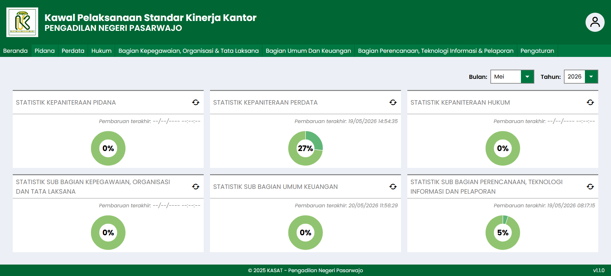
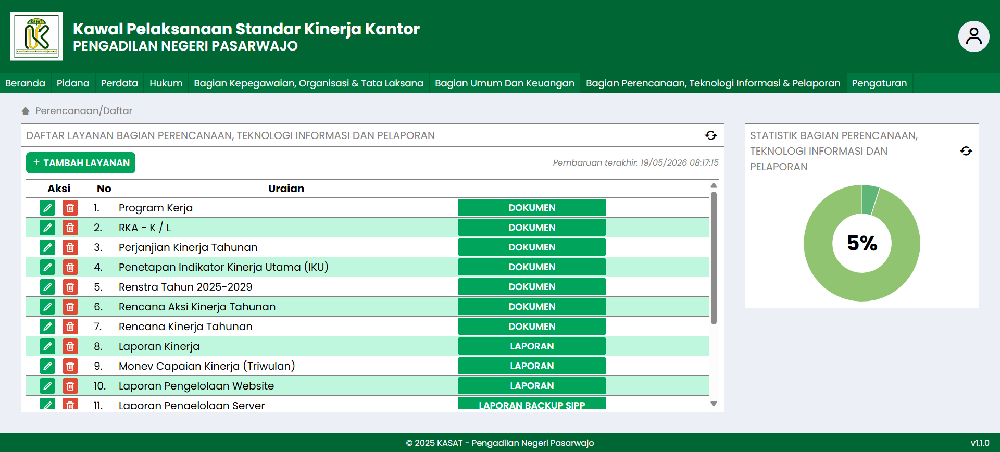
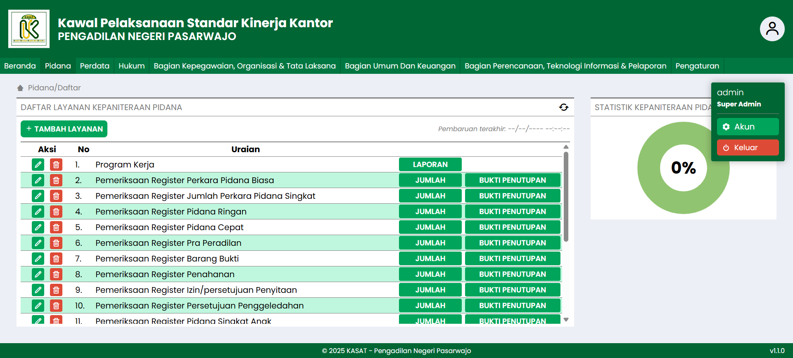
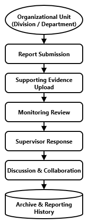
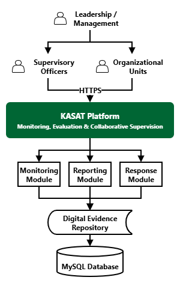

# KASAT
### Kawal Pelaksanaan Standar Kinerja Kantor
[]()
[]()
[]()

> Monitoring, Evaluation, Reporting, and Collaborative Supervision Platform

KASAT (Kawal Pelaksanaan Standar Kinerja Kantor) is a web-based monitoring and supervision platform developed to support internal oversight, performance evaluation, reporting, supporting document management, and collaborative communication between supervisors and organizational units.

The platform enables leadership, inspectors, and supervisory personnel to monitor organizational performance, review submitted reports, verify supporting evidence, and communicate directly with organizational units through contextual discussions attached to each report and monitoring activity.

By centralizing supervision, reporting, documentation, and communication into a single platform, KASAT improves transparency, accountability, efficiency, and organizational performance monitoring.

---

## Background

Effective supervision requires continuous monitoring of administrative activities, operational performance, reporting obligations, and supporting documentation across multiple organizational units.

Conventional supervision processes often depend on manual reporting, fragmented communication channels, physical document verification, and decentralized record keeping, resulting in:

- Delayed monitoring activities
- Difficult document verification
- Limited visibility of organizational performance
- Inefficient communication between supervisors and organizational units
- Increased administrative workload

KASAT was developed to address these challenges through a centralized digital supervision ecosystem that supports monitoring, reporting, verification, and collaborative communication.

---

## Objectives

### Digital Transformation

Modernize organizational supervision and evaluation processes through digital workflows.

### Performance Monitoring

Provide centralized oversight of organizational performance and compliance activities.

### Accountability

Support evidence-based monitoring through structured reporting and document verification.

### Transparency

Improve visibility of supervision activities and monitoring outcomes.

### Collaboration

Facilitate direct communication between supervisors and organizational units within the context of reports and monitoring records.

### Efficiency

Reduce administrative burden through integrated reporting and documentation management.

---

## Core Features

### Monitoring Dashboard

Provides a centralized overview of monitoring activities and organizational performance.

Features include:

- Performance overview
- Monitoring statistics
- Organizational monitoring summaries
- Reporting status overview
- Compliance tracking

---

### Digital Monitoring System

Supports structured supervision and monitoring activities across organizational units.

Features include:

- Monitoring records
- Monthly supervision activities
- Performance evaluations
- Compliance monitoring
- Monitoring documentation

---

### Reporting Management

Enables organizational units to submit and manage reports through a centralized system.

Features include:

- Report submission
- Report management
- Reporting history
- Monthly reporting
- Monitoring reports

---

### Collaborative Response System

A built-in communication module that allows supervisors and organizational units to communicate directly within reports and monitoring records.

The feature enables contextual discussions without relying on external communication channels.

Features include:

- Supervisor responses
- Organizational unit replies
- Clarification requests
- Follow-up discussions
- Contextual communication
- Discussion history tracking
- Report-centered collaboration

This feature transforms supervision from a one-way reporting process into a collaborative workflow where supervisors and organizational units can exchange information, discuss findings, and coordinate follow-up actions directly within the system.

---

### Digital Evidence Repository

Centralized storage for supporting documentation and evidence related to monitoring activities.

Supports:

- Supporting documents
- Photo documentation
- Verification evidence
- Administrative records
- Historical archives

---

### Document Verification

Facilitates review and verification of submitted evidence and supporting documentation.

Features include:

- Evidence review
- Document validation
- Supporting document verification
- Monitoring record verification

---

## Organizational Modules

KASAT supports monitoring and supervision activities across multiple organizational divisions.

### Criminal Administration Division

Monitoring activities related to criminal case administration, registers, detention records, evidence records, work programs, monthly reports, and supporting documentation.

### Civil Administration Division

Monitoring civil administration activities, financial reporting, case records, journals, and operational documentation.

### Legal Affairs Division

Monitoring legal aid services, public satisfaction surveys, complaint management, information services, reporting activities, and supporting documentation.

### Human Resources, Organization, and Governance Division

Monitoring personnel administration, organizational development, integrity programs, training activities, promotion planning, and governance documentation.

### General Affairs and Finance Division

Monitoring correspondence management, financial administration, procurement activities, asset management, operational support services, and facility management.

### Planning, Information Technology, and Reporting Division

Monitoring strategic planning, information technology management, server administration, website management, budgeting activities, and performance accountability reporting.

---

## Workflow

```text
Organizational Unit
        │
        ▼
Report Submission
        │
        ▼
Supporting Evidence Upload
        │
        ▼
Monitoring Review
        │
        ▼
Supervisor Response
        │
        ▼
Discussion & Clarification
        │
        ▼
Additional Information Submission
        │
        ▼
Verification
        │
        ▼
Reporting & Archive
```

---

## System Architecture

```text
+----------------------------------+
| Leadership & Supervisory Officers|
+----------------+-----------------+
                 |
                 ▼
+----------------------------------+
|              KASAT               |
+----------------+-----------------+
                 |
     +-----------+-----------+
     |                       |
     ▼                       ▼

Monitoring System     Reporting System

     |                       |
     +-----------+-----------+
                 |
                 ▼

Collaborative Response System

                 |
                 ▼

Digital Evidence Repository

                 |
                 ▼

Database
```

---

## Key Benefits

- Centralized supervision workflow
- Digital monitoring process
- Structured reporting management
- Collaborative communication
- Evidence-based evaluation
- Improved accountability
- Better transparency
- Faster verification process
- Reduced administrative workload
- Improved organizational oversight

---

## Project Highlights

### Monitoring & Evaluation

Supports systematic monitoring and evaluation activities across multiple organizational units.

### Collaborative Supervision

Enables direct communication between supervisors and organizational units through report-centered discussions and contextual responses.

### Evidence-Based Oversight

Ensures supervision activities are supported by verifiable documentation and supporting evidence.

### Centralized Management

Provides a single platform for monitoring, reporting, verification, and communication.

### Digital Transformation

Modernizes conventional supervision processes through integrated digital workflows.

---

## Repository Contents

This repository contains:

- Project overview
- Feature documentation
- Workflow illustrations
- Architecture diagrams
- User interface screenshots
- Portfolio presentation materials

The original production source code is not included.

---

## Screenshots

### Dashboard



### Monitoring Module



### Collaborative Response System


### Evidence Repository


### Organizational Modules



### Workflow



### System Architecture



---

## Project Status

Production System

---

## Ownership & Notice

This repository is maintained by Fernandy Maret Astriawan and published under the MarchTech brand.

The repository is intended exclusively for portfolio presentation, project documentation, and professional evaluation purposes.

Source code, production infrastructure, deployment configurations, sensitive data, proprietary implementation details, and operational data are not publicly available.

---

## License

All Rights Reserved.

See the LICENSE file for details.

© 2026 Fernandy Maret Astriawan — Developed under the MarchTech brand.
