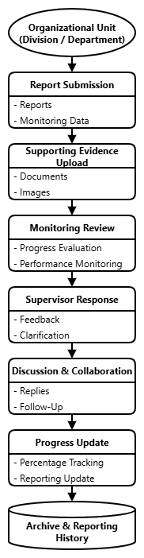
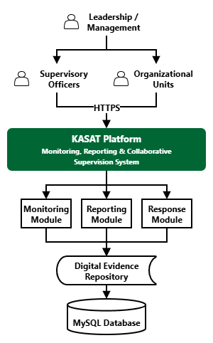
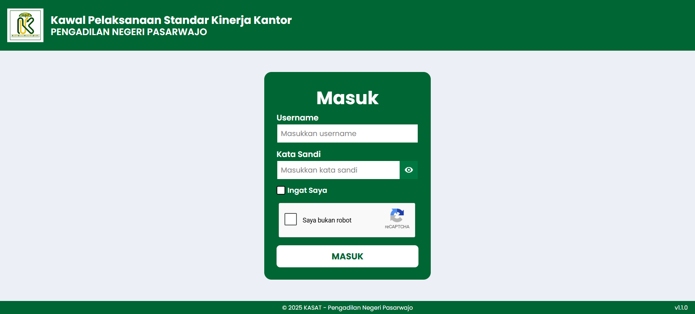
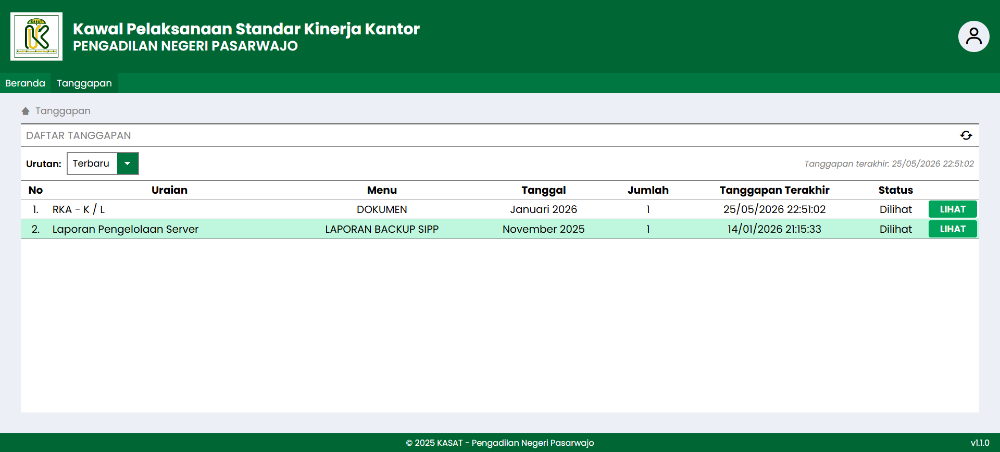
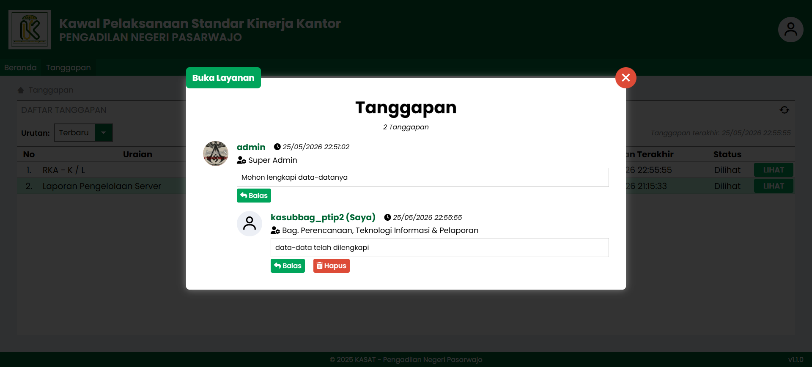
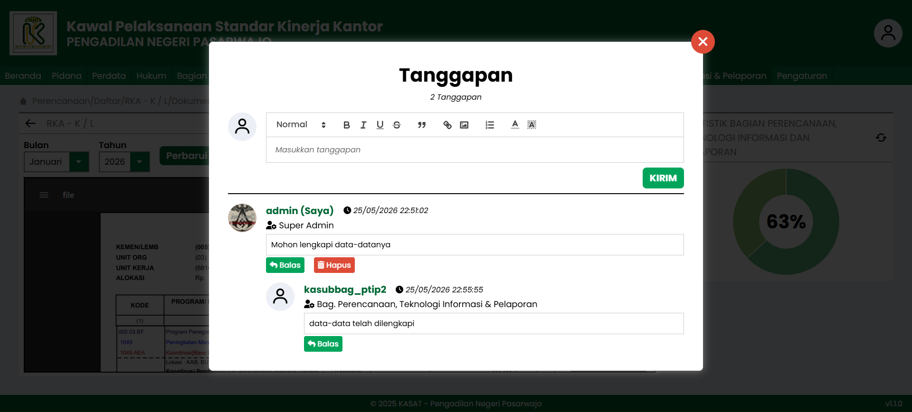
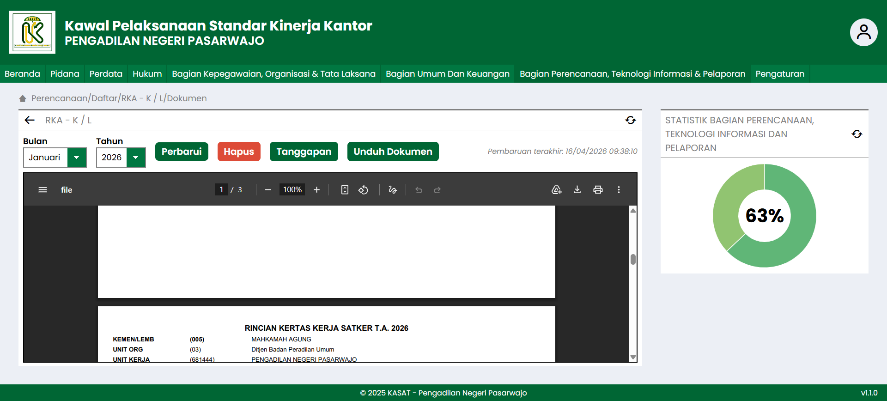

# KASAT
### Kawal Pelaksanaan Standar Kinerja Kantor

> Monitoring, Reporting, Progress Evaluation, and Collaborative Supervision Platform

KASAT (Kawal Pelaksanaan Standar Kinerja Kantor) is a web-based monitoring and collaborative supervision platform designed to support organizational oversight, reporting management, progress evaluation, supporting document management, and communication between supervisory personnel and organizational units.

The platform centralizes monitoring workflows, reporting activities, progress tracking, evidence management, and contextual discussions into a single integrated system to improve transparency, accountability, supervision efficiency, and organizational performance monitoring.

---

# Overview

KASAT was developed to modernize internal supervision and monitoring processes across multiple organizational divisions through centralized digital workflows.

The system enables organizational units to upload reports, supporting evidence, and monitoring data while allowing leadership personnel, supervisory officers, administrators, and reviewers to monitor performance progress, review submitted data, provide responses, request clarifications, and conduct collaborative supervision activities through an integrated discussion system.

Unlike conventional monitoring systems, KASAT combines progress-based monitoring, collaborative communication, reporting management, evidence verification, and role-based supervision into a unified web-based platform.

---

# Core Features

## Monitoring Dashboard

Provides a centralized overview of organizational monitoring activities and performance progress.

Features include:

* Performance overview
* Monitoring statistics
* Progress tracking
* Reporting summaries
* Organizational monitoring overview
* Percentage-based monitoring indicators
* Monthly and yearly monitoring summaries

---

## Progress-Based Monitoring System

KASAT monitors organizational performance based on the comparison between registered services and uploaded monitoring data.

The system calculates monitoring progress using:

* Organizational unit
* Service category
* Month
* Year
* Uploaded monitoring records

The monitoring result is represented as percentage-based progress indicators used to evaluate organizational monitoring performance.

---

## Reporting Management System

Supports report submission and reporting management workflows across organizational units.

Features include:

* Report submission
* Monthly reporting
* Monitoring reports
* Reporting history
* Data upload management
* Report archive management

---

## Collaborative Response System

A contextual communication system that enables supervisory personnel and organizational units to communicate directly within reports and monitoring records.

The system supports:

* Supervisor responses
* Organizational unit replies
* Discussion history
* Contextual discussions
* Clarification requests
* Follow-up communication
* Rich text responses
* Image attachments
* External links

This feature transforms supervision activities into collaborative workflows where supervisors and organizational units can exchange information, discuss monitoring results, and coordinate follow-up actions directly within the system.

---

## Digital Evidence Repository

Centralized storage for supporting documentation and monitoring evidence.

Supports:

* Documents
* Images
* Supporting files
* Administrative records
* Monitoring documentation
* Historical archives

---

## Real-Time Notification System

Provides real-time session-based notifications when new responses or discussions are submitted while users are logged into the KASAT platform.

---

## Dynamic Service Management

Administrators can manage monitoring services dynamically without modifying the core system.

Features include:

* Service registration
* Service updates
* Service management per organizational unit
* Monitoring service configuration

---

## User Management & Access Control

KASAT implements role-based and unit-based access control mechanisms to ensure secure supervision workflows and data isolation between organizational units.

---

# User Roles

## Super Administrator

Permissions include:

* Add users
* Delete users
* Block users
* Reset user passwords
* Manage monitoring services
* Access all organizational data
* Upload monitoring data

---

## Administrator

Permissions include:

* Manage monitoring services
* Access all organizational data
* Upload monitoring data

---

## Supervisory Officers / Reviewers

Permissions include:

* Access all organizational data
* Review reports
* Provide responses
* Conduct supervision activities

Supervisory officers cannot upload monitoring data.

---

## Organizational Units

Organizational units can only:

* Access their own unit data
* Upload monitoring data for their own unit
* Access:

  * Services
  * Responses

This mechanism ensures organizational data isolation and controlled supervision access.

---

# Organizational Modules

KASAT supports supervision and monitoring activities across multiple organizational divisions.

## Criminal Administration Division

Monitoring criminal administration activities, registers, detention records, evidence records, monthly reports, work programs, and supporting documentation.

---

## Civil Administration Division

Monitoring civil administration activities, operational records, financial reporting, journals, and supporting documentation.

---

## Legal Affairs Division

Monitoring legal aid services, complaint management, public information services, surveys, reporting activities, and supporting documents.

---

## Human Resources, Organization, and Governance Division

Monitoring personnel administration, governance activities, organizational programs, training activities, and integrity-related documentation.

---

## General Affairs & Finance Division

Monitoring financial administration, correspondence management, procurement activities, asset management, operational support services, and facility management.

---

## Planning, Information Technology & Reporting Division

Monitoring strategic planning, budgeting, server management, information technology infrastructure, website management, reporting activities, and organizational performance accountability.

---

# Workflow

The workflow begins when an organizational unit submits monitoring reports and supporting evidence through the KASAT platform.

Supervisory personnel review the submitted data, provide contextual responses, request clarifications, and conduct collaborative discussions directly within monitoring records and reports.

All monitoring records, supporting documents, discussions, and reporting histories are preserved as part of the organizational archive and supervision history.

---

# System Architecture

KASAT operates as a centralized supervision platform connecting leadership personnel, supervisory officers, administrators, and organizational units through integrated monitoring, reporting, and collaborative response modules.

Monitoring data, reports, supporting evidence, and discussion records are managed through a centralized evidence repository and application database.

---

# Technology Stack

## Backend

* Node.js
* Express.js
* REST API

---

## Frontend

* HTML5
* CSS3
* JavaScript
* Bootstrap

---

## Database

* MySQL

---

## Security & Access Control

* HTTPS
* Session Authentication
* Role-Based Access Control
* Unit-Based Access Restriction

---

# Key Benefits

* Centralized monitoring workflows
* Percentage-based progress evaluation
* Collaborative supervision workflows
* Contextual communication system
* Evidence-based monitoring
* Real-time supervision discussions
* Dynamic service management
* Organizational data isolation
* Improved transparency
* Improved accountability
* Reduced administrative fragmentation
* Better organizational oversight

---

# Project Highlights

## Progress-Based Monitoring

Monitoring performance is calculated based on uploaded monitoring data compared to registered organizational services.

---

## Collaborative Supervision

Enables direct communication between supervisors and organizational units through integrated response and discussion workflows.

---

## Dynamic Monitoring Configuration

Monitoring services can be updated dynamically without modifying the core application.

---

## Centralized Supervision Platform

Combines monitoring, reporting, evidence management, discussions, and supervision workflows into a single integrated platform.

---

## Role-Based Organizational Access

Implements organizational access restriction to ensure each unit can only access its own operational data.

---

# Repository Contents

This repository contains:

* Project overview
* Workflow documentation
* Architecture diagrams
* Feature descriptions
* User interface screenshots
* Portfolio presentation materials

The original production source code is not publicly available.

---

# Screenshots

## Login Interface

---

## Monitoring Dashboard

---

## Collaborative Response System — Discussion Overview

---

## Collaborative Response System — Contextual Discussion

---

## Collaborative Response System — Response Editor

---

## Monitoring Module

---

## Digital Evidence Repository

---

## Organizational Modules

---

# Project Status

Production System

---

# Ownership & Notice

This repository is maintained by Fernandy Maret Astriawan and published under the MarchTech brand.

The repository is intended exclusively for portfolio presentation, project documentation, and professional evaluation purposes.

Source code, production infrastructure, deployment configurations, sensitive data, credentials, proprietary implementation details, and operational data are not publicly available.

---

# License

All Rights Reserved.

See the LICENSE file for details.

© 2026 Fernandy Maret Astriawan — Developed under the MarchTech brand.
